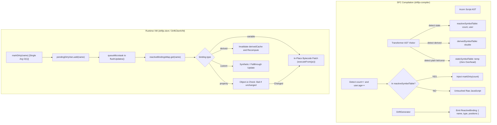

# Implementation Plan: Milestone 2 — Fine-Grained Reactive State Primitives

This document outlines the detailed architectural and implementation plan for **Milestone 2**: **Fine-Grained Reactive State Primitives (Signals, Computed Nodes, Effects, Props)** in DriftJS.

---

## 🎯 Milestone Overview & Goals

Milestone 2 replaces the legacy heuristic scope-scanning mechanism (`let` = reactive) with an explicit, compiler-driven fine-grained reactive state architecture.

### Key Architectural Pillars:
1. **Explicit Symbol Table Segregation (`reactiveSymbolTable`)**:
   - Only variables declared with `state(...)` and `derived(...)` are registered into the reactive symbol table.
   - Plain local variables (`let temp = 0`) and helper functions remain in `staticSymbolTable`, eliminating wasted constant-pool entries, dead reactive bindings, and runtime overhead.
2. **Neutral Identifier & Kind in `ReactiveBinding`**:
   - Refactor `ReactiveBinding` to store a neutral `name: string` (replacing the legacy `variable` field) and a `type: string` (`'variable' | 'property' | 'derived' | 'custom'`).
   - Keep `markDirty(name)` strictly single-argument for O(1) hash lookups with zero string-allocation overhead.
   - Implement fast equality bailouts (`Object.is`) in the VM runtime before executing DOM mutations.
3. **Zero-Boilerplate Ergonomics**:
   - Natural JavaScript mutations: `count++`, `count = 10`, `user.age++` auto-trigger reactivity via compiler AST transformation.
   - Zero `.value` unwrapping, zero `.set()` / `.get()` calls required in user code.
4. **Computed / Derived State Nodes (`derived`)**:
   - Pure, memoized derivation nodes that re-evaluate only when tracked dependencies mutate.
   - Cached across reads within the same microtask pass.
5. **Side-Effect Subscriptions (`effect`)**:
   - Declarative side-effect runner with automatic teardown/cleanup callbacks executing post-microtask flush.
6. **Component Props Contract (`props`)**:
   - Structured component input contract with compile-time validation, immutability, and default fallback values.

---

## 🏗️ Architecture & Data Flow



---

## 📋 Component-by-Component Implementation

---

### Component 1: Compiler Type Definitions & Bytecode Contract (`driftjs-compiler` & `driftjs-shared`)

#### [MODIFY] `packages/compiler/types/opcodes.ts`
- Update `ReactiveBinding` interface:
  ```ts
  export type ReactiveBindingKind = 'variable' | 'property' | 'derived' | 'custom';

  export interface ReactiveBinding {
    readonly type: string; // 'variable' | 'property' | 'derived' | 'custom'
    readonly name: string; // Neutral identifier (formerly 'variable')
    readonly positions: readonly number[];
  }
  ```
- Deprecate / remove legacy `variable` field in favor of neutral `name`.

#### [MODIFY] `packages/utils/src/constants.ts` & `packages/utils/types/index.ts`
- Export shared reactive primitive tokens and symbol names (`STATE_TOKEN`, `DERIVED_TOKEN`, `EFFECT_TOKEN`).

---

### Component 2: Compiler AST Transformer & Symbol Segregation (`driftjs-compiler`)

#### [MODIFY] `packages/compiler/src/transformer.ts`
1. **Symbol Table Triage**:
   - Traverse `VariableDeclaration` nodes in `<script>` AST:
     - If `init` is a `CallExpression` calling `state(...)`: record identifier into `reactiveSymbolTable`.
     - If `init` is a `CallExpression` calling `derived(...)`: record identifier into `derivedSymbolTable` and extract dependency identifiers from its callback body.
     - Else: record into `staticSymbolTable`.
2. **Ergonomic Mutation Auto-Desugaring**:
   - Traverse `AssignmentExpression` (`count = ...`, `user.age = ...`) and `UpdateExpression` (`count++`, `--count`):
     - If root identifier exists in `reactiveSymbolTable`:
       - Append dirty trigger invocation: `__drift_mark_dirty__('${rootName}')`.
     - If in `staticSymbolTable`: leave untouched as raw JavaScript.
3. **Template Expression Binding Extraction**:
   - During template interpolation and directive analysis:
     - Check identifiers against `reactiveSymbolTable` and `derivedSymbolTable`.
     - Assign correct `type`:
       - `'variable'` if identifier is a primitive state cell.
       - `'property'` if it is a member access on a state cell (`user.age`).
       - `'derived'` if it references a computed node.
       - `'custom'` for non-direct synthetic expressions.
     - Ignore any identifiers belonging strictly to `staticSymbolTable`.

#### [MODIFY] `packages/compiler/src/generator.ts`
- Update code generation to emit new `ReactiveBinding` schema:
  `{ type: binding.type, name: binding.name, positions: binding.positions }`.
- Ensure constant pool and module output adhere to the neutral `name` field.

---

### Component 3: Client Runtime Engine (`driftjs-dom`)

#### [MODIFY] `packages/dom/src/index.ts` (`DriftClientVM`)
1. **Scope Initialization**:
   - Export and wire runtime primitive factories into component scope:
     - `state(initialValue)`: creates/registers state cell.
     - `derived(computeFn)`: creates memoized computation node.
     - `effect(fn)`: registers reactive effect callback.
     - `props(spec)`: initializes validated component props contract.
2. **Refactored `markDirty(name: string)`**:
   - Retain single string parameter: `markDirty(name: string)` for O(1) hash lookups.
   - Look up bindings in `reactiveBindingsMap.get(name)`.
3. **Fast Equality Bailout & Type Handling**:
   - When processing bindings:
     - If `type === 'property'`: evaluate expression and perform `Object.is` check against previous register value. If equal, bypass DOM patching.
     - If `type === 'derived'`: invalidate cache in `derivedCache` before executing dependent bytecode positions.
4. **Derived Node Execution & Dependency Resolution**:
   - Guarantee topological evaluation order: evaluate dirty upstream state cells before evaluating derived nodes.
   - Cache results within the same microtask flush cycle.
5. **Effect Subscription Pipeline**:
   - Run dirty effect callbacks after microtask DOM reconciliation.
   - Handle returned cleanup/teardown functions before re-executing effect.

---

### Component 4: Server Runtime Synchronization (`driftjs-ssr`)

#### [MODIFY] `packages/ssr/src/index.ts` (`DriftServerVM`)
- Support synchronous evaluation of `state(...)` and `derived(...)` cells during headless HTML serialization.
- Ignore client-only `effect(...)` execution during server render passes.
- Provide default values for unsupplied component `props(...)`.

---

### Component 5: DevTools Compatibility (`devtool`)

#### [MODIFY] `devtool/src/injected.ts` & `devtool/types/bridge.ts`
- Update `VMSnapshot` reactive binding serialization to use `name` and `type`.
- DevTools Scope panel: display state cells with their reactive type badge (`[state]`, `[derived]`, `[static]`).

---

## 🧪 Verification & Test Suite Plan

### 1. Compiler Unit Tests (`packages/compiler/tests/`)
- `transformer.test.ts`:
  - Test segregation of `state()`, `derived()`, and plain `let`.
  - Verify that plain `let` variables DO NOT generate `ReactiveBinding` entries.
  - Verify auto-desugaring of `count++` into assignment + `markDirty('count')`.
  - Verify that member assignments (`user.age = 31`) trigger `markDirty('user')`.
- `generator.test.ts`:
  - Verify generated bytecode module contains `{ type, name, positions }` bindings.

### 2. Runtime Client VM Tests (`packages/dom/tests/`)
- `state.test.ts` (New test suite):
  - Test atomic state cell updates and in-place DOM patching.
  - Test natural mutations (`count++`, `count += 5`, `user.name = 'Bob'`).
  - Verify non-reactive variables do not trigger updates.
- `derived.test.ts`:
  - Test computed memoization and cache reuse across multiple template interpolations.
  - Test multi-level derived dependency chains (`a` -> `b` -> `c`).
  - Verify `Object.is` bailout prevents redundant DOM mutations.
- `effect.test.ts`:
  - Test side-effect invocation post-microtask flush.
  - Test execution of effect cleanup callbacks on subsequent invalidations and on component unmount.
- `props.test.ts`:
  - Test props immutability and default fallback values.

### 3. Server-Side Rendering Tests (`packages/ssr/tests/`)
- Verify `state` and `derived` values render correctly in `renderToString()`.

### 4. Full Workspace Verification Commands
```bash
pnpm typecheck
pnpm vitest run --project compiler --project utils --project dom --project ssr --project devtools
pnpm test
```
